# Project Name: DevOps Boootcamp Project

# Objektif
- Membina AWS infrastruktur menggunakan kemahiran DevOps
- Mempraktikkan dua belas keluarga dalam satu sistem

# Senarai 12 Keluarga
1. DevOps
2. Linux
3. Git
4. GitHub
5. AWS
6. Cloudflare
7. Docker
8. CI/CD
9. Terraform
10. Ansible
11. Prometheus
12. Grafana

---

# Pemeriksaan Kesediaan Persekitaran Kerja

## Host
wsl --version\
WSL version: 2.6.1.0\
Kernel version: 6.6.87.2-1\
WSLg version: 1.0.66\
MSRDC version: 1.2.6353\
Direct3D version: 1.611.1-81528511\
DXCore version: 10.0.26100.1-240331-1435.ge-release\
Windows version: 10.0.26200.9445

docker --version\
Docker version 29.6.1, build 8900f1d

docker compose version\
Docker Compose version v5.3.0

## WSL
aws --version\
aws-cli/2.34.64 Python/3.14.5 Linux/6.6.87.2-microsoft-standard-WSL2 exe/x86_64.ubuntu.24\

git --version\
git version 2.43.0

terraform --version\
Terraform v1.15.8 on linux_amd64

Your version of Terraform is out of date! The latest version is 1.16.2.

Remark:
- After upgrade Terraform version

\
terraform --version\
Terraform v1.16.2 on linux_amd64

ansible --version\
ansible [core 2.21.2]\
  config file = /etc/ansible/ansible.cfg
  configured module search path = ['/home/hadi/.ansible/plugins/modules', '/usr/share/ansible/plugins/modules']
  ansible python module location = /usr/lib/python3/dist-packages/ansible
  ansible collection location = /home/hadi/.ansible/collections:/usr/share/ansible/collections
  executable location = /usr/bin/ansible
  python version = 3.12.3 (main, Aug 31 2026, 10:18:26) [GCC 13.3.0] (/usr/bin/python3)
  jinja version = 3.1.2
  pyyaml version = 6.0.1 (with libyaml v0.2.5)

## Pengujian komunikasi Docker Desktop dengan WSL
docker run --rm hello-world\
Unable to find image 'hello-world:latest' locally\
latest: Pulling from library/hello-world\
4f55086f7dd0: Pull \
d5e71e642bf5: Download complete\
Digest: sha256:5e23090353324d887c48ad5e5c56d294eab81588df9605b07d1afe895f9cc8f8\
Status: Downloaded newer image for hello-world:latest

## Periksa AWS Sumber

### Pengguna IAM
aws iam get-user\
{
    "User": {
        "Path": "/",
        "UserName": "iam-xxxx",
        "UserId": "AIDA2MF5YZJFIAJxxxxxx",
        "Arn": "arn:aws:iam::713362xxxxxx:user/iam-hadi",
        "CreateDate": "2026-09-13T03:32:30+00:00"
    }
}

Remark:
- Boleh balik rujuk nota XXX

### Kumpulan Pengguna
aws iam list-groups-for-user \
  --user-name iam-xxx

{
    "Groups": []
}

### Semak Polisi
aws iam list-attached-user-policies \
  --user-name iam-xxxx

{
    "AttachedPolicies": [
        {
            "PolicyName": "AdministratorAccess",
            "PolicyArn": "arn:aws:iam::aws:policy/AdministratorAccess"
        }
    ]
}

### Konfigurasi Akses
aws sts get-caller-identity
{
    "UserId": "AIDA2MF5YZJFIAJ7xxxxx",
    "Account": "713362xxxxx",
    "Arn": "arn:aws:iam::713362xxxxxx:user/iam-xxxx"
}

### Lokasi
aws configure get region
ap-southeast-1

### VPC
aws ec2 describe-vpcs \
  --region ap-southeast-1 \
  --query 'Vpcs[*].[VpcId,CidrBlock,Tags]' \
  --output table

Remark:
- Tiada VPC konfigurasi

### Subnets
aws ec2 describe-subnets \
  --region ap-southeast-1 \
  --query 'Subnets[*].[SubnetId,VpcId,CidrBlock,AvailabilityZone,MapPublicIpOnLaunch]' \
  --output table

Remark:
- Tiada Subnet konfigurasi

### Instances
aws ec2 describe-instances \
  --region ap-southeast-1 \
  --query 'Reservations[*].Instances[*].[InstanceId,PrivateIpAddress,PublicIpAddress,State.Name,Tags]' \
  --output table

Remark:
- Tiada Instance konfigurasi

# Checklist
Date: 2026-09-13
Time: 1230

- [x] Host readiness
- [x] AWS konfigurasi

---

# Cipta Folder Kerja
mkdir ~/devops-bootcamp-terraform-mhadiyahya
mkdir ~/devops-bootcamp/final-project-mhadiyahya
mkdir ~/devops-bootcamp-project

Remark:
- Folder kerja ini akan digunakan sebagai Repo di GitHub

#  Menyediakan Terraform fail

## File TF provider.tf
Di fail ini dinyatakan provider and region AWS
- Provider: AWS
- Reqion: ap-southeast-1

Remark: ap-southeast-1 berada di Singapore

## File TF network.tf
Di fail ini dinyatakan network di AWS
| Jenis Rangkaian | Name | Detail | Remark |
| :-- | :-- | :-- | :-- | 
| VPC | devops-vpc | 10.0.0.0/24 | Mempunyai 256 IP Address | 
| subnet public | devops-public-subnet | 10.0.0.0/25 | Pecahan pertama IP Address 10.0.0.0 - 10.0.0.127 |
| subnet private | devops-private-subnet | 10.0.0.128/25 | Pecahan pertama IP Address 10.0.0.128 - 10.0.0.255 |
| route table public | devops-public-route | | |
| route table private | devops-private-route | | |
| gateway | devops-igw | | |
| gateway | devops-ngw | | |

## Terraform Format
terraform fmt

Remark:
- Bagi mengemaskan code

## Initialize Terraform
terraform init

terraform init
Initializing the backend...

Initializing provider plugins...
- Finding hashicorp/aws versions matching "~> 6.0"...
- Installing hashicorp/aws v6.64.0...
- Installed hashicorp/aws v6.64.0 (signed by HashiCorp)

Terraform has created a lock file .terraform.lock.hcl to record the provider
selections it made above. Include this file in your version control repository
so that Terraform can guarantee to make the same selections by default when
you run "terraform init" in the future.

Terraform has been successfully initialized!

You may now begin working with Terraform. Try running "terraform plan" to see
any changes that are required for your infrastructure. All Terraform commands
should now work.

If you ever set or change modules or backend configuration for Terraform,
rerun this command to reinitialize your working directory. If you forget, other
commands will detect it and remind you to do so if necessary.

Remark:
- Initialize berjaya

## Validate
terraform validate

Success! The configuration is valid.

## Terraform Plan
terraform plan

Plan: 3 to add, 0 to change, 0 to destroy.

Remark:
- 3 plan untuk di tambah adalah merujuk kepada VPC, Public Subnet, dan Private Subnet.
- Diperingkat ini review plan sebelum apply.

## Terraform Apply
terraform apply

Plan: 3 to add, 0 to change, 0 to destroy.

Do you want to perform these actions?
  Terraform will perform the actions described above.
  Only 'yes' will be accepted to approve.

  Enter a value: <yes|no>

aws_vpc.devops_vpc: Creating...
aws_vpc.devops_vpc: Creation complete after 4s [id=vpc-03e3081ff4b1d161e]
aws_subnet.private_subnet: Creating...
aws_subnet.public_subnet: Creating...
aws_subnet.private_subnet: Creation complete after 0s [id=subnet-00f409c0be083e3e8]
aws_subnet.public_subnet: Still creating... [00m10s elapsed]
aws_subnet.public_subnet: Creation complete after 11s [id=subnet-0b9a674ba29be81a2]

Apply complete! Resources: 3 added, 0 changed, 0 destroyed.

Remark:
- Boleh menggunakan command ini sebagai alternative terraform apply -auto-approve
- Terraform apply berjaya.

## Periksa AWS Setelah Terraform Berjaya
aws ec2 describe-vpcs \
  --filters "Name=tag:Name,Values=devops-vpc" \
  --query 'Vpcs[*].[VpcId,CidrBlock]' \
  --output table

Remark:
- Output menunjukkan VPC tercipta dengan subnet 10.0.0.0/24

aws ec2 describe-subnets \
  --filters "Name=tag:Project,Values=mhadiyahya" \
  --query 'Subnets[*].[SubnetId,CidrBlock,AvailabilityZone,MapPublicIpOnLaunch]' \
  --output table

Remark:
- Terdapat dua subnet dicipta.
- Subnet pertama untuk public dengan subnet 10.0.0.0/25
- Subnet kedua untuk private dengan subnet 10.0.0.128/25
- Network sudah tersedia.
- Seterusnya buat Internet Gateway, Route Table, and NAT Gateway.

### Network Diagram Public Subnet
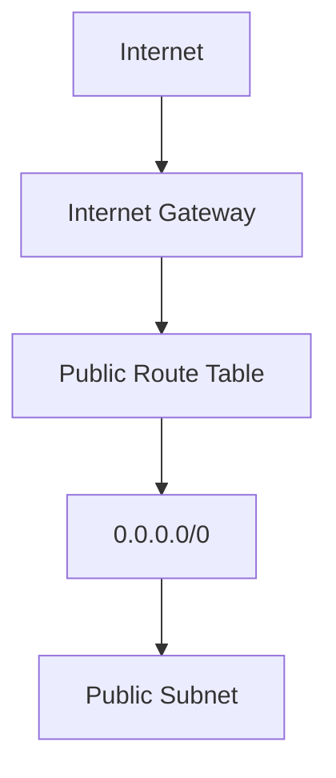

### Network Diagram Private Subnet
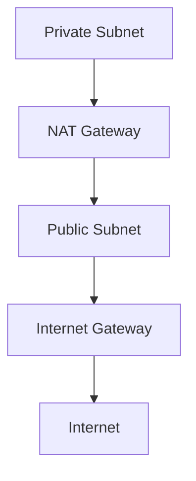

# Checklist
Date: 2026-09-13
Time: 1304

- [x] AWS Provide
- [x] VPC
- [x] Public subnet
- [x] Private subnet

---

# Mencipta Internet Gateway

## Periksa terraform state
terraform state list
aws_subnet.private_subnet
aws_subnet.public_subnet
aws_vpc.devops_vpc

## Update network.tf file

### Tambah resource bagi IGW

resource "aws_internet_gateway" "devops_igw" {
  vpc_id = aws_vpc.devops_vpc.id

  tags = {
    Name    = "devops-igw"
    Project = "mhadiyahya"
  }
}

Remark:
- Cipta IGW.

### Tambah Public Route Table

resource "aws_route_table" "public_route" {
  vpc_id = aws_vpc.devops_vpc.id

  route {
    cidr_block = "0.0.0.0/0"
    gateway_id = aws_internet_gateway.devops_igw.id
  }

  tags = {
    Name    = "devops-public-route"
    Project = "mhadiyahya"
  }
}

Remark:
- Semua network traffic 0.0.0.0/0 akan route ke IGW.

### Sambung Public Subnet Kepada Route Table

resource "aws_route_table_association" "public_route_association" {
  subnet_id      = aws_subnet.public_subnet.id
  route_table_id = aws_route_table.public_route.id
}

Remark:
- Flow devops-public-subnet > devop-public-route > devop-igw
- Route table untuk public lengkap

## Update workflow Terraform
terraform fmt\
terraform validate\
terraform plan

Remark:
- Plan: 3 to add, 0 to change, 0 to destroy.
- 3 plan itu adalah IGW, Route Table, Route Table Association bagi Public Subnet.

terraform apply

Remark:
- Apply complete! Resources: 3 added, 0 changed, 0 destroyed.

## Network Diagram bagi Public Subnet
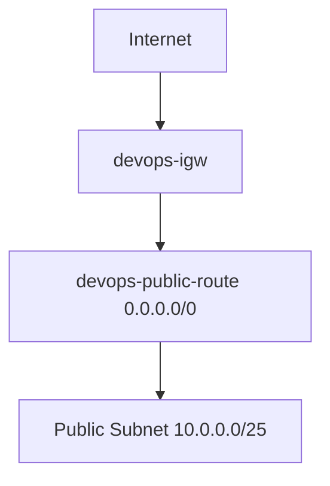

# Checklist
Date: 2026-09-13
Time: 1324

- [x] IGW
- [x] Public Route Table
- [x] Public Route Association

---

# Cipta Private Subnet Ke Internet, Menetapkan Elastic IP dan NAT Gateway

## Periksa terraform state
terraform state list
aws_internet_gateway.devops_igw
aws_route_table.public_route
aws_route_table_association.public_route_association
aws_subnet.private_subnet
aws_subnet.public_subnet
aws_vpc.devops_vpc

## Update network.tf file

### Tetapan Elastic IP

resource "aws_eip" "nat_eip" {
  domain = "vpc"

  tags = {
    Name    = "devops-nat-eip"
    Project = "mhadiyahya"
  }
}

Remark:
- Elastic IP ini akan digunakan oleh NAT Gateway.

### Cipta NAT Gateway

resource "aws_nat_gateway" "devops_ngw" {
  allocation_id = aws_eip.nat_eip.id
  subnet_id     = aws_subnet.public_subnet.id

  depends_on = [
    aws_internet_gateway.devops_igw
  ]

  tags = {
    Name    = "devops-ngw"
    Project = "mhadiyahya"
  }
}

Remark:
- NAT Gateway mesti berada dalam public subnet, bukan private subnet.

### Private Route Table

resource "aws_route_table" "private_route" {
  vpc_id = aws_vpc.devops_vpc.id

  route {
    cidr_block     = "0.0.0.0/0"
    nat_gateway_id = aws_nat_gateway.devops_ngw.id
  }

  tags = {
    Name    = "devops-private-route"
    Project = "mhadiyahya"
  }
}

Remark:
- Private traffic ke Internet
- 10.0.0.0/128 > devops-private-route > 0.0.0.0/0 > devops-ngw

### Sambung Private Subnet ke Route Table

resource "aws_route_table_association" "private_route_association" {
  subnet_id      = aws_subnet.private_subnet.id
  route_table_id = aws_route_table.private_route.id
}

Remark:
- Flow devops-private-subnet > devops-private-route

## Update workflow Terraform
terraform fmt\
terraform validate\
terraform plan

Remark:
- Plan: 4 to add, 0 to change, 0 to destroy.
- 1 plan itu adalah Elastic IP.
- 3 plan lagi untuk NAT Gateway, Route Table, Route Table Associate untuk Private Subnet. 

terraform apply

Remark:
- Apply complete! Resources: 3 added, 0 changed, 0 destroyed.

## Network Diagram bagi Private Subnet
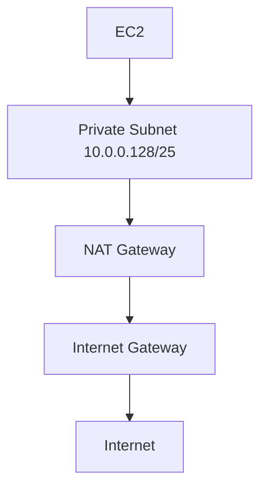

## Verify AWS Networking

NAT Gateway\
aws ec2 describe-nat-gateways \
  --filter "Name=tag:Name,Values=devops-ngw" \
  --query 'NatGateways[*].[NatGatewayId,State,SubnetId]' \
  --output table

Remark:
- NAT Gateway status available

\
Elastic IP\
aws ec2 describe-addresses \
  --region ap-southeast-1 \
  --output json

aws ec2 describe-addresses \
  --region ap-southeast-1 \
  --query "Addresses[*].[AllocationId,PublicIp,Tags[?Key=='Name']|[0].Value]" \
  --output table

Remark:
- Public IP given

Route Tables\
aws ec2 describe-route-tables \
  --filters "Name=vpc-id,Values=$(aws ec2 describe-vpcs \
  --filters 'Name=tag:Name,Values=devops-vpc' \
  --query 'Vpcs[0].VpcId' \
  --output text)" \
  --query 'RouteTables[*].[RouteTableId,Routes,Tags]' \
  --output json

Remark:
- 10.0.0.0/24 - devops-private-route
- 0.0.0.0/0 - IGW

\
> [!CAUTION]\
> Network setting dibawah tidak percuma di AWS. Sila buang/destroy selesai selesai testing.
> 1. NAT Gateway
> 2. Elastic IP
> 3. EC2
> 4. EBS

## Destory
terraform plan -destroy\
terraform destroy

# Checklist
Date: 2026-09-13
Time: 1324

- [x] Elastic IP (Public IP Address verify at AWS Portal)
- [x] NAT Gateway
- [x] Private Route Table
- [x] Private Route Association

---

# AWS Security
Berdasarkan artiktektur project, hanya port 80 sahaja yang perlu dibuka untuk access kepada Web Server.\
Pastikan semua instance mempunya internet connection.\
Instance hanya boleh diakses melalui SSM.

> [!WARNING]\
> SSH port 22 is prohobited.

## File TF security.tf
Dibahagikan kepada dua bahagian:\
- Public Security
- Private Security

### Public Security
- Allow incoming port 80 for web server.
- Allow incoming port 9100 to 10.0.0.136/32 (monitoring)
- Allow egress connection to Internet.

### Private Security
- Allow egress connection to Internet.

# AWS IAM Role untuk SSM
Cipta IAM role baru untuk kegunaan EC2 instance.\
Kenapa tidak iam-hadi, kerana user ini mempunyai access penuh.

## File TF iam.tf
Cipta IAM role baru bernama devops-ssm-role.\
Assign policy AmazonSSMManagedInstanceCore.

# AWS EC2

## File TF compute.tf
Tetapkan root image.\
Cipta config EC2 bagi Web Server, Controller, dan Monitoring.\
Tetapan Private IP Address kepada ketiga-tiga EC2.\
Tetapan Elastic IP Address kepada Web Server.\
Tetapan tiada public IP Address kepada Controller dan Monitoring.


## Update workflow Terraform
terraform fmt\
terraform validate\
terraform plan

Remark:
- Plan: 14 to add, 0 to change, 0 to destroy.
- Senarai Plan:
1. Compute: AMI image Ubuntu 24.04 LTS
2. Compute: 1x EC2 Controller
3. Compute: 1x EC2 Monitoring
4. Compute: 1x EC2 Web Server
5. Network: Tetap Web Server kepada Elastic IP
6. Network: Resource allocation for Web Server 
7. IAM: Cipte new IAM Role devops-ssm-role
8. IAM: Assign policy
9. IAM: Cipta profile devops-ssm-instance-profile
10. Security: Security Public Group and Security Private Group
11. Security: Rule allow incoming port 80 from Internet
12. Security: Rule allow monitoring server to access Node Exporter
13. Security: Rule allow Egress public traffic
14. Security: Rule allow Egress private traffic

terraform apply

Remark:
- Apply complete! Resources: 14 added, 0 changed, 0 destroyed.

# Verify EC2 deployed
aws ec2 describe-instances \
  --region ap-southeast-1 \
  --filters "Name=tag:Project,Values=mhadiyahya" \
  --query 'Reservations[].Instances[].[Tags[?Key==`Name`]|[0].Value,InstanceId,PrivateIpAddress,PublicIpAddress,State.Name]' \
  --output table

Remark:
| Instance | Private IP | Public IP | Status |
| :-- | :-- | :-- | :-- |
| devops-web-server | 10.0.0.5 | 18.136.237.99 | running |
| devops-monitoring | 10.0.0.136 | none | running |
| devops-controller | 10.0.0.135 | none | running |

# Verify SSM on EC2
aws ssm describe-instance-information \
  --region ap-southeast-1 \
  --query 'InstanceInformationList[*].[InstanceId,PingStatus,PlatformName,AgentVersion]' \
  --output table

# Instance Access using SSM
Web-Server
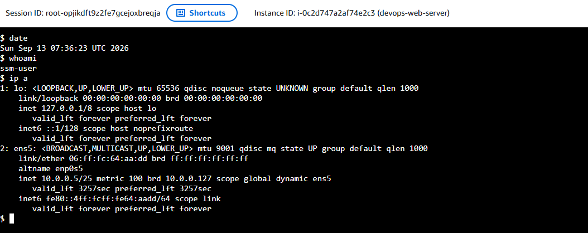

Controller
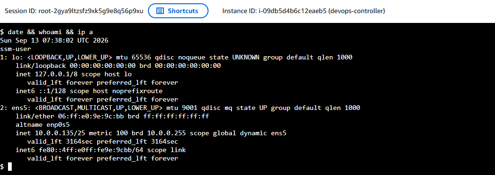

Monitoring
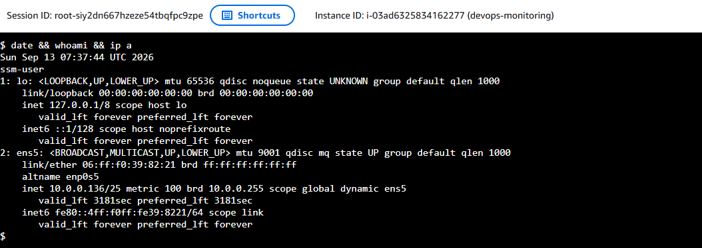

# Instance Ping Internet
Web-Server
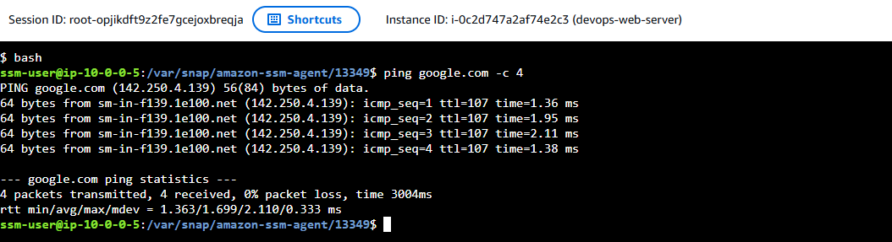

Controller
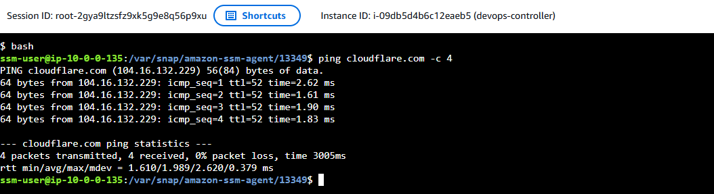

Monitoring
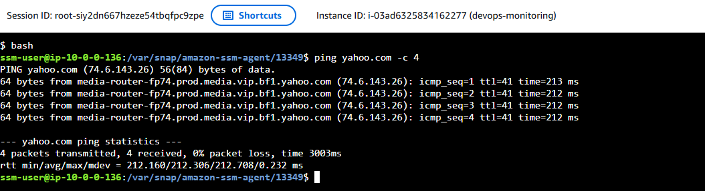

# Checklist
Date: 2026-09-13
Time: 1540

- [x] IAM Role for devops-ssm-role
- [x] Compute konfigurasi
- [x] Private network ketiga-tiga EC2
- [x] Berjaya set public IP web-server menggunakan Elastic IP
- [x] Berjaya access ketiga-tiga EC2 menggunkan Console x SSM.
- [x] Ping google, ping yahoo, dan ping cloudflare berjaya dari EC2.
- [x] Ping diantara ketiga-tiga EC2 tidak dibenarkan. Protcol ICMP tidak dimasukkan kepada security group.

# Optional

## Add local ping
resource "aws_vpc_security_group_ingress_rule" "public_icmp" {
  security_group_id = aws_security_group.public_sg.id

  cidr_ipv4   = "10.0.0.0/24"
  ip_protocol = "icmp"
  from_port   = -1
  to_port     = -1

  description = "Allow ICMP from VPC"
}

resource "aws_vpc_security_group_ingress_rule" "private_icmp" {
  security_group_id = aws_security_group.private_sg.id

  cidr_ipv4   = "10.0.0.0/24"
  ip_protocol = "icmp"
  from_port   = -1
  to_port     = -1

  description = "Allow ICMP from VPC"
}
---

# Backend Terraform
Buat masa ini terraform files berada di local.
Untuk langkah berikutnya saya akan migrate ke S3 Bucket.
Selepas itu tukar kepada block backend.

## Migration Prep

### Verify state
terraform state list
data.aws_ami.ubuntu
aws_eip.nat_eip
aws_eip.web_eip
aws_eip_association.web_eip_association
aws_iam_instance_profile.ssm_profile
aws_iam_role.ssm_role
aws_iam_role_policy_attachment.ssm_core
aws_instance.controller
aws_instance.monitoring
aws_instance.web_server
aws_internet_gateway.devops_igw
aws_nat_gateway.devops_ngw
aws_route_table.private_route
aws_route_table.public_route
aws_route_table_association.private_route_association
aws_route_table_association.public_route_association
aws_security_group.private_sg
aws_security_group.public_sg
aws_subnet.private_subnet
aws_subnet.public_subnet
aws_vpc.devops_vpc
aws_vpc_security_group_egress_rule.private_egress
aws_vpc_security_group_egress_rule.public_egress
aws_vpc_security_group_ingress_rule.public_http
aws_vpc_security_group_ingress_rule.public_node_exporter

### Check any pending plan
terraform plan

Remark:
- Plan: 2 to add, 0 to change, 2 to destroy.
- Action: # aws_eip_association.web_eip_association must be replaced
- Action: # aws_instance.web_server must be replaced

### Validate
Plan: 2 to add, 0 to change, 2 to destroy. - sbb nak tukar associate_public_ip_address = false\
go to go with terraform apply.

## Migration ke S3 

### Create bucket
aws s3api create-bucket \
  --bucket devops-bootcamp-terraform-mhadiyahya \
  --region ap-southeast-1 \
  --create-bucket-configuration LocationConstraint=ap-southeast-1

Remark:
{
    "Location": "http://devops-bootcamp-terraform-mhadiyahya.s3.amazonaws.com/",
    "BucketArn": "arn:aws:s3:::devops-bootcamp-terraform-mhadiyahya"
}

### Versioning
aws s3api put-bucket-versioning \
  --bucket devops-bootcamp-terraform-mhadiyahya \
  --versioning-configuration Status=Enabled

### Block public access
aws s3api put-public-access-block \
  --bucket devops-bootcamp-terraform-mhadiyahya \
  --public-access-block-configuration \
  BlockPublicAcls=true,IgnorePublicAcls=true,BlockPublicPolicy=true,RestrictPublicBuckets=true

### Encryption
aws s3api put-bucket-encryption \
  --bucket devops-bootcamp-terraform-mhadiyahya \
  --server-side-encryption-configuration \
  '{"Rules":[{"ApplyServerSideEncryptionByDefault":{"SSEAlgorithm":"AES256"},"BucketKeyEnabled":true}]}'

### Verification
Verify Status\
aws s3api get-bucket-versioning \
  --bucket devops-bootcamp-terraform-mhadiyahya

Remark:
{
    "Status": "Enabled"
}

Verify Block\
aws s3api get-public-access-block \
  --bucket devops-bootcamp-terraform-mhadiyahya

Remark:
{
    "PublicAccessBlockConfiguration": {
        "BlockPublicAcls": true,
        "IgnorePublicAcls": true,
        "BlockPublicPolicy": true,
        "RestrictPublicBuckets": true
    }
}

Verify Encryption\
aws s3api get-bucket-encryption \
  --bucket devops-bootcamp-terraform-mhadiyahya

Remark:
{
    "ServerSideEncryptionConfiguration": {
        "Rules": [
            {
                "ApplyServerSideEncryptionByDefault": {
                    "SSEAlgorithm": "AES256"
                },
                "BucketKeyEnabled": true,
                "BlockedEncryptionTypes": {
                    "EncryptionType": [
                        "SSE-C"
                    ]
                }
            }
        ]
    }
}

Verity Content\
aws s3api list-objects-v2 \
  --bucket devops-bootcamp-terraform-mhadiyahya

Remark:
{
    "RequestCharged": null,
    "Prefix": ""
}

### Buat data sandaran
cp terraform.tfstate terraform.tfstate.pre-s3-migration.backup\
ls -lh terraform.tfstate*\
Permissions Size User Date Modified Name\
.rw-r--r--   56k hadi 13 Sep 16:40  󱁢 terraform.tfstate\
.rw-r--r--   54k hadi 13 Sep 16:40   terraform.tfstate.backup\
.rw-r--r--   56k hadi 13 Sep 16:55   terraform.tfstate.pre-s3-migration.backup

### Migrate init
terraform fmt\
terraform init -migrate-state

Remark:
- Successfully configured the backend "s3"! Terraform will automatically use this backend unless the backend configuration changes.
- Terraform has been successfully initialized!

### Migrate post
terraform state list
terraform plan

Remark:
- No changes. Your infrastructure matches the configuration.

### Verify remote state
aws s3api list-objects-v2 \
  --bucket devops-bootcamp-terraform-mhadiyahya \
  --prefix devops-bootcamp-project/ \
  --query 'Contents[].{Key:Key,Size:Size,LastModified:LastModified}' \
  --output table

Remark:
| Key | astModified | Size |
| :-- | :-- | :-- |
| devops-bootcamp-project/terraform.tfstate | 2026-09-13T09:05:55+00:00 | 56066 |

## Exclude certain Terraform file from git tracking
git ls-files | rg '(^|/)\.terraform/|\.tfstate|\.tfplan$|\.tfvars|\.pem$|\.key$'\
jika ada result\
tembah ini kedalam .gitignore\
.terraform/\
*.tfstate\
*.tfstate.*

keluarkan dari git tracking\
git rm -r --cached .terraform\
git rm --cached terraform.tfstate terraform.tfstate.backup

verify lagi sekali\
git status --short

## Optional - delete wrong bucket name during S3 bucket creation
aws s3api list-objects-v2 \
  --bucket devops-bootcamp-terraform-hadi-yahya \
  --output json

aws s3api list-object-versions \
  --bucket devops-bootcamp-terraform-hadi-yahya \
  --output json

aws s3api delete-bucket \
  --bucket devops-bootcamp-terraform-hadi-yahya \
  --region ap-southeast-1

aws s3api list-buckets \
  --query "Buckets[?Name=='devops-bootcamp-terraform-hadi-yahya'].Name" \
  --output text

# Checklist
Date: 2026-09-13
Time: 1734

- [x] Prep S3 Bucket and Block bucket from public access
- [x] Pre-migration check
- [x] Migrate
- [x] Post migrate check

---

# Controller (Ansible)

## Host check (Using AWS Console)
bash\
whoami\
hostname\
hostname -I\
cat /etc/os-release\
python3 --version\
command -v python3\

## Verify sudo
sudo -n true\
echo $?

Remark:
- Expected result = 0
- SSM boleh menjalankan sudo.

## Verify network and NAT Gateway
ip -brief address\
ip route\
getent hosts pypi.org
curl -I --max-time 10 https://pypi.org\
curl -I --max-time 10 https://galaxy.ansible.com

## Prep-Controller
sudo apt update\
sudo apt install -y pipx  
pipx --version

Remark:
- pipx version is 1.4.3

## Tambah lokasi aplikasi pipx kepada PATH
pipx ensurepath

Remark:
- Success! Added /home/ssm-user/.local/bin to the PATH environment variable.
- Consider adding shell completions for pipx. Run 'pipx completions' for instructions.
- You will need to open a new terminal or re-login for the PATH changes to take effect

reload shell dengan exit dan bash semula

echo "$PATH"

Remark:
- /usr/local/sbin:/usr/local/bin:/usr/sbin:/usr/bin:/sbin:/bin:/usr/games:/usr/local/games:/snap/bin:/home/ssm-user/.local/bin

## Install Ansible Core
pipx install ansible-core==2.19.13

Remark:
- installed package ansible-core 2.19.13, installed using Python 3.12.3
- These apps are now globally available
    - ansible
    - ansible-config
    - ansible-console
    - ansible-doc
    - ansible-galaxy
    - ansible-inventory
    - ansible-playbook
    - ansible-pull
    - ansible-test
    - ansible-vault

## Verify installation
command -v ansible

Remark:
- /home/ssm-user/.local/bin/ansible

ansible --version

Remark:
- ansible [core 2.19.13]
- python version = 3.12.3 (main, Aug 31 2026, 10:18:26) [GCC 13.3.0] (/home/ssm-user/.local/share/pipx/venvs/ansible-core/bin/python)
- jinja version = 3.1.6
- pyyaml version = 6.0.3 (with libyaml v0.2.5)

ansible-playbook --version

Remark:
- ansible-playbook [core 2.19.13]
- python version = 3.12.3 (main, Aug 31 2026, 10:18:26) [GCC 13.3.0] (/home/ssm-user/.local/share/pipx/venvs/ansible-core/bin/python)
- jinja version = 3.1.6
- pyyaml version = 6.0.3 (with libyaml v0.2.5)

ansible-galaxy --version

Remark:
- ansible-galaxy [core 2.19.13]
- python version = 3.12.3 (main, Aug 31 2026, 10:18:26) [GCC 13.3.0] (/home/ssm-user/.local/share/pipx/venvs/ansible-core/bin/python)
- jinja version = 3.1.6
- pyyaml version = 6.0.3 (with libyaml v0.2.5)

pipx list

Remark:
- venvs are in /home/ssm-user/.local/share/pipx/venvs
- apps are exposed on your $PATH at /home/ssm-user/.local/bin
- manual pages are exposed at /home/ssm-user/.local/share/man
- package ansible-core 2.19.13, installed using Python 3.12.3
    - ansible
    - ansible-config
    - ansible-console
    - ansible-doc
    - ansible-galaxy
    - ansible-inventory
    - ansible-playbook
    - ansible-pull
    - ansible-test
    - ansible-vault

## Private SSH
SSH ke Web Server dan Monitoring untuk Controller

### Add ingress ke security.tf
- Allow private SSH from Ansible Controller to Web Server

resource "aws_vpc_security_group_ingress_rule" "public_ssh_from_controller" {
  security_group_id = aws_security_group.public_sg.id

  cidr_ipv4   = "10.0.0.135/32"
  ip_protocol = "tcp"
  from_port   = 22
  to_port     = 22

  description = "Allow SSH from Ansible Controller"
}

- Allow private SSH from Ansible Controller to Monitoring Server

resource "aws_vpc_security_group_ingress_rule" "private_ssh_from_controller" {
  security_group_id = aws_security_group.private_sg.id

  cidr_ipv4   = "10.0.0.135/32"
  ip_protocol = "tcp"
  from_port   = 22
  to_port     = 22

  description = "Allow SSH from Ansible Controller"
}

terraform fmt  
terraform validate  
terraform plan

Remark:
- Plan: 2 to add, 0 to change, 0 to destroy.
- aws_vpc_security_group_ingress_rule.private_ssh_from_controller will be created
- aws_vpc_security_group_ingress_rule.public_ssh_from_controller will be created

terraform apply

### Testing
telnet 10.0.0.5 22
telnet 10.0.0.136 22

## SSH Key Auth

### Generate key pada Controller
mkdir -p ~/.ssh
chmod 700 ~/.ssh

Generate dedicated Ansible key  
ssh-keygen \
  -t ed25519 \
  -a 100 \
  -f ~/.ssh/ansible_ed25519 \
  -C "ansible-controller@mhadiyahya" \
  -N ""

ls -l ~/.ssh/ansible_ed25519*

cat ~/.ssh/ansible_ed25519.pub

salin public key

### Authorize key dekat web server & monitoring
sudo install -d \
  -m 700 \
  -o ubuntu \
  -g ubuntu \
  /home/ubuntu/.ssh

echo '<PUBLIC_KEY>' | \
  sudo tee -a /home/ubuntu/.ssh/authorized_keys >/dev/null

sudo chown ubuntu:ubuntu /home/ubuntu/.ssh/authorized_keys
sudo chmod 600 /home/ubuntu/.ssh/authorized_keys

### Test SSH
ssh \
  -i ~/.ssh/ansible_ed25519 \
  -o IdentitiesOnly=yes \
  ubuntu@10.0.0.5

> [!NOTE]
> devops-bootcamp-terraform-mhadiyahya move to devops-bootcamp-mhadiyahya dir

## Inventory dan Ansible ping

### Projek dir
mkdir -p ~/devops-bootcamp-project/ansible
mkdir -p ~/devops-bootcamp-project/ansible/inventory
mkdir -p ~/devops-bootcamp-project/ansible/playbooks
mkdir -p ~/devops-bootcamp-project/ansible/roles

### ansible.cfg
nano ansible.cfg\
[defaults]
inventory = ./inventory/hosts.ini
remote_user = ubuntu
private_key_file = ~/.ssh/ansible_ed25519
host_key_checking = True
retry_files_enabled = False
roles_path = ./roles
interpreter_python = auto_silent

### inventory
nano inventory/hosts.ini\
[web_servers]
web01 ansible_host=10.0.0.5

[monitoring_servers]
monitoring01 ansible_host=10.0.0.136

[managed_nodes:children]
web_servers
monitoring_servers

[all:vars]
ansible_python_interpreter=/usr/bin/python3

### Verify configuration
pwd  
/home/ssm-user/devops-bootcamp-project/ansible

ansible --version  

Remark:
- look for config file = /home/ssm-user/devops-bootcamp-project/ansible/ansible.cfg

ansible-config dump --only-changed

Remark:
- Pastikan inventory, remote user dan private key merujuk kepada nilai yang ditetapkan.
- DEFAULT_PRIVATE_KEY_FILE(/home/ssm-user/devops-bootcamp-project/ansible/ansible.cfg) = /home/ssm-user/.ssh/ansible_ed25519
- DEFAULT_REMOTE_USER(/home/ssm-user/devops-bootcamp-project/ansible/ansible.cfg) = ubuntu

ansible-inventory --graph

Remark
- view struktur inventory

### Ping test guna ansible
ansible all -m ansible.builtin.ping

Remark:
web01 | SUCCESS => {
    "changed": false,
    "ping": "pong"
}
monitoring01 | SUCCESS => {
    "changed": false,
    "ping": "pong"
}

### verify hostname
ansible all \
  -m ansible.builtin.command \
  -a "hostname"

Remark:
web01 | CHANGED | rc=0 >>
ip-10-0-0-5
monitoring01 | CHANGED | rc=0 >>
ip-10-0-0-136

### Verify privilege escalation
ansible all \
  --become \
  -m ansible.builtin.command \
  -a "whoami"

Remark: 
web01 | CHANGED | rc=0 >>
root
monitoring01 | CHANGED | rc=0 >>
root

## Backup Ansible file at Controller menggunakan git
cd ~/devops-bootcamp-project
git rev-parse --is-inside-work-tree
git remote -v

Remark:
- fatal: not a git repository


### Dapatkan repo projek
git remote get-url origin (dekat laptop)

GIT_TERMINAL_PROMPT=0 git ls-remote \
  https://github.com/mhadiyahya/devops-bootcamp-project.git \
  HEAD

Remark:
- <commit-hash>    HEAD 
- Repo public

### Pindahkan working folder semasa sebagai backup
cd ~
test -e ~/devops-bootcamp-project-controller-backup \
  && echo "BACKUP PATH EXISTS" \
  || echo "BACKUP PATH AVAILABLE"

Remark:
- BACKUP PATH AVAILABLE

mv \
  ~/devops-bootcamp-project \
  ~/devops-bootcamp-project-controller-backup

### Clone repo sebenar
git clone \
  https://github.com/mhadiyahya/devops-bootcamp-project.git \
  ~/devops-bootcamp-project

cd ~/devops-bootcamp-project  
git remote -v  
git branch --show-current  
git status  

Remark:
- nothing to commit, working tree clean

### Gabungkan ansible working files
cd ~/devops-bootcamp-project  

test -e ansible \
  && echo "ANSIBLE DIRECTORY EXISTS" \
  || echo "ANSIBLE DIRECTORY AVAILABLE"

cp -a \
  ~/devops-bootcamp-project-controller-backup/ansible \
  ~/devops-bootcamp-project/

git status --short

Remark:
- ?? ansible/

cd ~/devops-bootcamp-project/ansible
ansible-galaxy role info geerlingguy.docker

### Requirement dan Install role
cd ~/devops-bootcamp-project/ansible
nano requirements.yml

Remark:
---
roles:
  - name: geerlingguy.docker
    src: https://github.com/geerlingguy/ansible-role-docker.git
    scm: git
    version: 1d3968dbf0df48515ffda0f6561cbd25206f502a

### Exclude download role daripada Git
cd ~/devops-bootcamp-project
nano .gitignore

Remark
# Ansible Galaxy downloaded roles
ansible/roles/*
!ansible/roles/.gitkeep

# Ansible retry files
*.retry

Cipta placeholder supaya direktori reles/ wujud dalam Git
touch ansible/roles/.gitkeep

Install Role
cd ~/devops-bootcamp-project/ansible
ansible-galaxy role install \
  --role-file requirements.yml \
  --roles-path ./roles

Remark:
- geerlingguy.docker was installed successfully

Verify role  
ansible-galaxy role list

Remark:
- geerlingguy.docker

git status --short

regression test
cd ~/devops-bootcamp-project/ansible
ansible all -m ansible.builtin.ping

Remark:
- "ping": "pong"

### Controller git checkpoint
cd ~/devops-bootcamp-project  
git switch -c feature/ansible-controller  
git add \
  .gitignore \
  ansible/ansible.cfg \
  ansible/inventory/hosts.ini \
  ansible/requirements.yml \
  ansible/roles/.gitkeep

git status --short  
git diff --cached --stat  
git diff --cached  

Remark:
- Pastikan tiada:
    - private SSH key;
    - AWS credentials;
    - token;
    - Terraform state;
    - downloaded role source.

git config user.name ""
git config user.email ""

# Bina dan Validate Docker Playbook

## Checking docker version
ansible all \
  -m ansible.builtin.command \
  -a "docker --version"

Remark:
- patut failed/error sebab docker belum install.

## Cipta Playbook
nano playbooks/install-docker.yml

---
- name: Install Docker on managed nodes
  hosts: managed_nodes
  become: true

  vars:
    docker_edition: ce
    docker_install_compose_plugin: true
    docker_users:
      - ubuntu

  roles:
    - role: geerlingguy.docker

## Syntax check
ansible-playbook \
  playbooks/install-docker.yml \
  --syntax-check

Remark:
- playbook: playbooks/install-docker.yml

## Semak target playbook
ansible-playbook \
  playbooks/install-docker.yml \
  --list-hosts

Remark:
hosts (2):
  web01
  monitoring01

## Check mode
ansible-playbook \
  playbooks/install-docker.yml \
  --check \
  --diff

Remark:
- monitoring01               : ok=13   changed=2    unreachable=0    failed=1    skipped=10   rescued=0    ignored=3   
- web01                      : ok=13   changed=2    unreachable=0    failed=1    skipped=10   rescued=0    ignored=3

## Install docker di web01 (web server)
ansible-playbook \
  playbooks/install-docker.yml \
  --limit web01 \
  --diff

Remark:
- web01                      : ok=18   changed=5    unreachable=0    failed=0    skipped=10   rescued=0    ignored=0   

verify version
ansible web01 \
  -m ansible.builtin.command \
  -a "docker --version"

Remark:
- Docker version 29.8.0, build 88096ef

ansible web01 \
  -m ansible.builtin.command \
  -a "docker compose version"

Remark:
- Docker Compose version v5.5.1

ansible web01 \
  -m ansible.builtin.command \
  -a "systemctl is-active docker"

Remark:
- active

ansible web01 \
  -m ansible.builtin.command \
  -a "systemctl is-enabled docker"

Remark:
- enabled

ansible web01 \
  -m ansible.builtin.command \
  -a "docker ps"

Remark:
- CONTAINER ID   IMAGE     COMMAND   CREATED   STATUS    PORTS     NAMES

## Install docker di monitoring01 (monitoring)
cd ~/devops-bootcamp-project/ansible
ansible-playbook \
  playbooks/install-docker.yml \
  --limit monitoring01 \
  --diff

Remark:
- monitoring01               : ok=18   changed=5    unreachable=0    failed=0    skipped=10   rescued=0    ignored=0

## Final test kedua-dua host
ansible-playbook playbooks/install-docker.yml

Remark:
- monitoring01               : ok=13   changed=0    unreachable=0    failed=0    skipped=12   rescued=0    ignored=0   
- web01                      : ok=13   changed=0    unreachable=0    failed=0    skipped=12   rescued=0    ignored=0

## Git checkpoint
cd ~/devops-bootcamp-project  
git status --short --untracked-files=all  
git add ansible/playbooks/install-docker.yml  
git diff --cached  
git commit -m "feat(ansible): install Docker on managed nodes"  
git push  
git status  

# Checkpoint
Date: 2026-09-13
Time: 21:09

- [x] Ansible setup di controller
- [x] Ansible boleh access the web server and monitoring
- [x] Buat playbook
- [x] Install docker di web server (web01) and monitoring (monitoring01)

# Infratify/ship
mkdir -p ~/source
git clone \
  https://github.com/Infratify/ship.git \
  ~/source/infratify-ship

cd ~/source/infratify-ship

git remote -v
git branch --show-current
git log -1 --oneline
git status

Remark:
- On branch main
- Your branch is up to date with 'origin/main'.
- nothing to commit, working tree clean

## Inspect source file
list senarai file\
rg --files

semak scripts\
sed -n '1,160p' package.json

semak customization\
sed -n '1,120p' ship.config.json

semak pre-flight test\
sed -n '1,220p' scripts/preflight.mjs

semak build configuration\
sed -n '1,180p' vite.config.js

semak size source\
du -sh .

semak node wujud atau tidak\
command -v node || echo "Node is not installed on Controller"

## Planning build
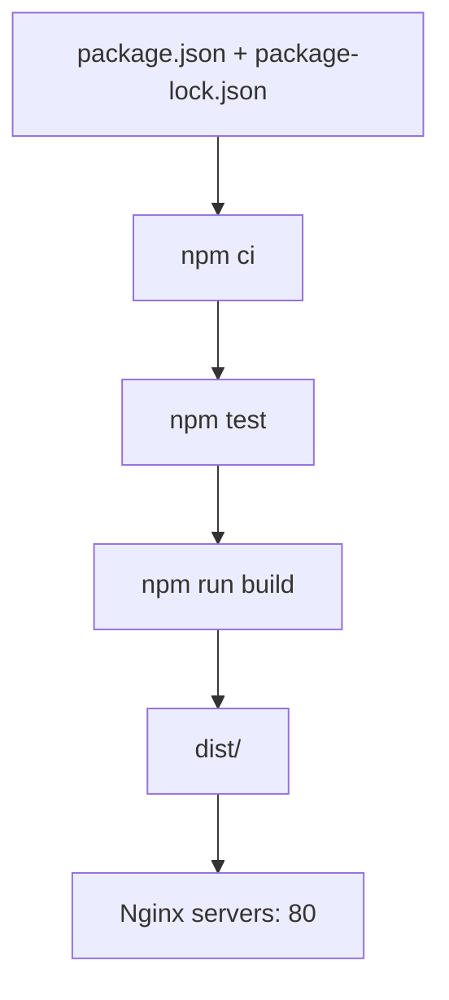
## Import source ke project
buat branch baru\
cd ~/devops-bootcamp-project

git switch main  
git pull --ff-only origin main  
git switch -c feature/docker-application

Remark:
- Switched to a new branch 'feature/docker-application'

copy source\
mkdir -p application/ship

rsync -av \
  --exclude='.git/' \
  --exclude='node_modules/' \
  --exclude='dist/' \
  ~/source/infratify-ship/ \
  application/ship/

Remark:
- sent 802,780 bytes  received 788 bytes  1,607,136.00 bytes/sec
- total size is 799,764  speedup is 1.00

simpan commit upstream sebagai rekod provenance\
git -C ~/source/infratify-ship rev-parse HEAD \
  > application/ship/UPSTREAM_COMMIT

verify hasil copy\
cd ~/devops-bootcamp-project

test ! -d application/ship/.git \
  && echo "PASS: nested .git excluded" \
  || echo "FAIL: nested .git exists"

test -f application/ship/package-lock.json \
  && echo "PASS: package-lock.json copied"

test -f application/ship/UPSTREAM_COMMIT \
  && echo "PASS: upstream commit recorded"

cat application/ship/UPSTREAM_COMMIT

git status --short

Remark:
- PASS: nested .git excluded
- PASS: package-lock.json copied
- PASS: upstream commit recorded
- b7943d6f76ff390641b84000331a6b8b0c35335f
- ?? application/

# Checkpoint
Date: 2026-09-13
Time: 

- [x] Clone Intratify/ship
- [x] Inspect file
- [x] Branch baru nama feature/docker-application
- [x] Copy clone Intratify/ship kepada application/ship

# Customize Ship for DevOps Project

## ship.config.json
cd ~/devops-bootcamp-project

git branch --show-current
test -f application/ship/package.json \
  && echo "PASS: application source exists"

Remark:
- PASS: application source exists

git branch --show-current

Remark:
- feature/docker-application

nano application/ship/ship.config.json

{
  "shipName": "Hadi Yahya Lab",
  "color": "#FFD700",
  "shipModel": "fighter",
  "emblem": "comet"
}

Verify\
python3 -m json.tool application/ship/ship.config.json
{
    "shipName": "Hadi Yahya Lab",
    "color": "#FFD700",
    "shipModel": "fighter",
    "emblem": "comet"
}

## Cipta Docker ignore
nano application/ship/.dockerignore

.git
.gitignore

node_modules
dist
coverage

.env
.env.*

*.log
.DS_Store

Verify\
sed -n '1,120p' application/ship/.dockerignore
.git
.gitignore

node_modules
dist
coverage

.env
.env.*

*.log
.DS_Store

## Fahami multi-stage build
| Stage | Base image | Tujuan |
| :-- | :-- | :-- |
| builder | node:22-alpine | Install dependency, test and build aplikasi |
| runtime | nginx:stable-alpine | Serve static files daripada dist/ pada port 80 |

Aliran
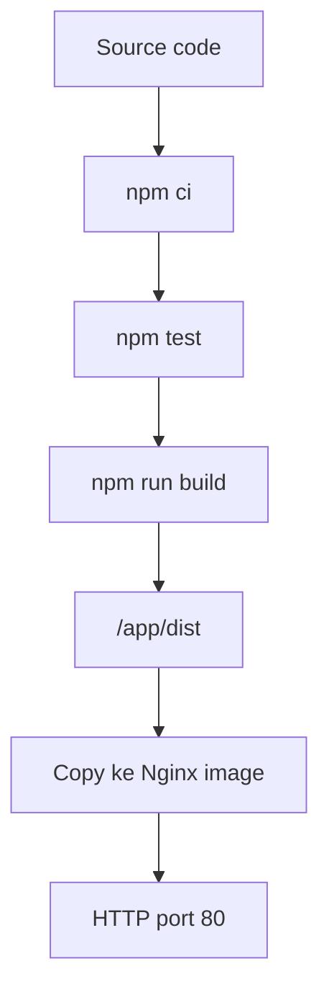

## Dockerfile multi-stage
nano application/ship/Dockerfile

```dockerfile
# Stage 1: Build and test the Vite application
FROM node:22-alpine AS builder

WORKDIR /app

# Copy dependency manifests first to improve layer caching
COPY package.json package-lock.json ./

# Install exact dependency versions from package-lock.json
RUN npm ci

# Copy application source
COPY . .

# Validate ship.config.json
RUN npm test

# Produce static files in /app/dist
RUN npm run build


# Stage 2: Serve only the compiled static files
FROM nginx:stable-alpine AS runtime

COPY --from=builder /app/dist/ /usr/share/nginx/html/

EXPOSE 80

CMD ["nginx", "-g", "daemon off;"]
```

Semak file dan status Git\\
sed -n '1,220p' application/ship/Dockerfile

git status --short

Remark:
- sed -n '1,220p' application/ship/Dockerfile

git status --short

## Manual build pada Web Server
Copy file ship ke web server
```bash
rsync -av \
  -e "ssh -i /home/ssm-user/.ssh/NAMA_KEY -o IdentitiesOnly=yes" \
  ~/devops-bootcamp-project/application/ship/ \
  ubuntu@10.0.0.5:/home/ubuntu/ship-build/
```

Verify salinan
```bash
ssh \
  -i /home/ssm-user/.ssh/NAMA_KEY \
  -o IdentitiesOnly=yes \
  ubuntu@10.0.0.5 \
  'cd ~/ship-build && ls -la && test -f Dockerfile && echo "PASS: Dockerfile copied"'
```

Remark:
total 96
drwxr-xr-x 5 ubuntu ubuntu  4096 Sep 13 15:06 .
drwxr-x--- 6 ubuntu ubuntu  4096 Sep 13 15:23 ..
-rw-r--r-- 1 ubuntu ubuntu    74 Sep 13 14:41 .dockerignore
-rw-r--r-- 1 ubuntu ubuntu    48 Sep 13 14:09 .gitignore
-rw-r--r-- 1 ubuntu ubuntu   424 Sep 13 14:09 CREDITS.md
-rw-r--r-- 1 ubuntu ubuntu   583 Sep 13 15:06 Dockerfile
-rw-r--r-- 1 ubuntu ubuntu  1559 Sep 13 14:09 README.md
-rw-r--r-- 1 ubuntu ubuntu    41 Sep 13 14:26 UPSTREAM_COMMIT
-rw-r--r-- 1 ubuntu ubuntu   303 Sep 13 14:09 index.html
-rw-r--r-- 1 ubuntu ubuntu 34633 Sep 13 14:09 package-lock.json
-rw-r--r-- 1 ubuntu ubuntu   508 Sep 13 14:09 package.json
drwxr-xr-x 2 ubuntu ubuntu  4096 Sep 13 14:09 public
drwxr-xr-x 3 ubuntu ubuntu  4096 Sep 13 14:09 scripts
-rw-r--r-- 1 ubuntu ubuntu   104 Sep 13 14:40 ship.config.json
drwxr-xr-x 2 ubuntu ubuntu  4096 Sep 13 14:09 src
-rw-r--r-- 1 ubuntu ubuntu   767 Sep 13 14:09 vite.config.js
PASS: Dockerfile copied

Access ke web server
```bash
ssh ubuntu@10.0.0.5
cd ~/ship-build
```

Check port 80 belum digunakan
```bash
sudo ss -lntp | rg ':80\b' \
  || echo "PASS: port 80 available"
```

Remark:
- PASS: port 80 available

Build image
```bash
docker build \
  --progress=plain \
  --tag ship-app:local \
  .
```

Test and Build
```bash
npm test
npm install
npm run build
```

Remark:
- ✓ pre-flight OK — "Hadi Yahya Lab" cleared for launch
- ✓ built in success.

Periksa image
```bash
docker image ls ship-app:local
```

Remark:
| IMAGE | ID | DISK USAGE | CONTENT SIZE | EXTRA |
| :-- | :-- | :-- | :-- | :-- |
| ship-app:local | 8c8b9dc28983 | 103MB | 29MB | 

Jalankan container
```bash
docker run -d \
  --name ship-local-test \
  --publish 80:80 \
  ship-app:local
```

Remark:
- 21040ec88a2f2557398ba548dbe86d21bf37f262f032cf830eb77c66d71a011e

Verify
```bash
docker ps --filter name=ship-local-test

curl --fail --head http://127.0.0.1

docker exec ship-local-test sh -c \
  'command -v node || echo "PASS: Node.js absent from runtime image"'
```

Remark:
- CONTAINER ID   IMAGE            COMMAND                  CREATED          STATUS          PORTS                                 NAMES
- 21040ec88a2f   ship-app:local   "/docker-entrypoint.…"   53 seconds ago   Up 53 seconds   0.0.0.0:80->80/tcp, [::]:80->80/tcp   ship-local-test

```text
HTTP/1.1 200 OK
Server: nginx/1.30.4
Date: Sun, 13 Sep 2026 15:41:18 GMT
Content-Type: text/html
Content-Length: 404
Last-Modified: Sun, 13 Sep 2026 15:32:51 GMT
Connection: keep-alive
ETag: "6aa6c223-194"
Accept-Ranges: bytes
```

```text
docker exec ship-local-test sh -c \
  'command -v node || echo "PASS: Node.js absent from runtime image"'
```

Test di Controller terminal
```bash
curl --fail --head http://10.0.0.5
```

Remark
```text
HTTP/1.1 200 OK
Server: nginx/1.30.4
Date: Sun, 13 Sep 2026 15:42:42 GMT
Content-Type: text/html
Content-Length: 404
Last-Modified: Sun, 13 Sep 2026 15:32:51 GMT
Connection: keep-alive
ETag: "6aa6c223-194"
Accept-Ranges: bytes
```

> [!NOTE]
> Semasa sesi manual build docker, kena install NPM. Pelan nak masukkan pemasangan npm ke Ansible untuk web dan monitoring. Tetapi tidak perlu kerana node dan npm sudah tersedia dalam builder container.

Cubaan docker build tanpa cache
```bash
cd ~/ship-build

docker build \
  --no-cache \
  --progress=plain \
  --tag ship-app:verify \
  .
```

List ship-app
```bash
docker image ls 'ship-app'
```

Remark:                                                                                     
IMAGE             ID             DISK USAGE   CONTENT SIZE   EXTRA
ship-app:local    8c8b9dc28983        103MB           29MB    U   
ship-app:verify   ab1ac8f6900a        103MB           29MB        

Remove ship-app:verify
```bash
docker image rm ship-app:verify
```

Setelah pengujian secara manual. proceed dengan commit.

```bash
cd ~/devops-bootcamp-project

git status --short
git diff -- application/ship/ship.config.json
git diff -- application/ship/Dockerfile
git diff -- application/ship/.dockerignore
```

```bash
git add application/ship

git commit -m "feat(docker): add multi-stage application image"

git push -u origin feature/docker-application
```

Gabung kan PR.