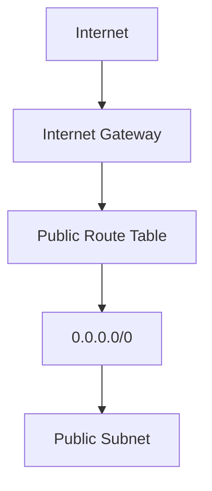
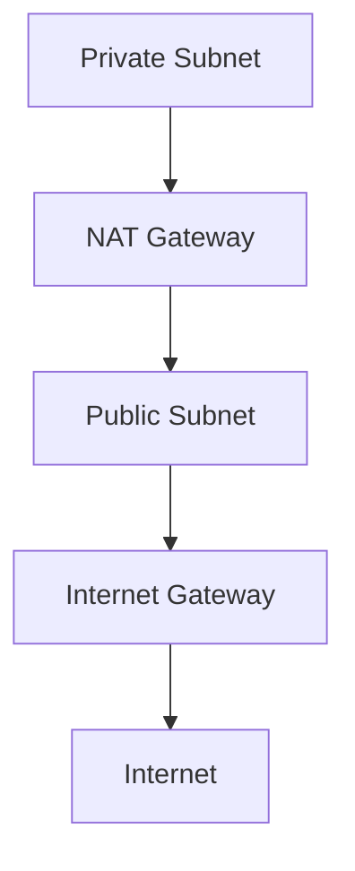
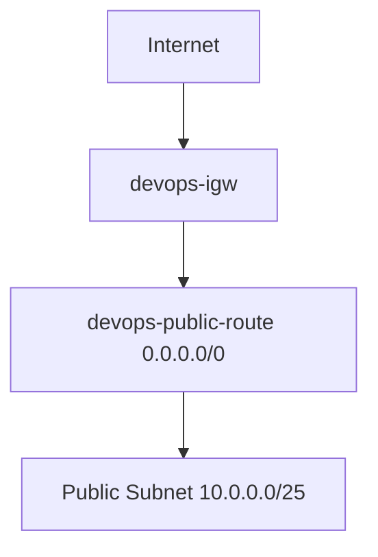
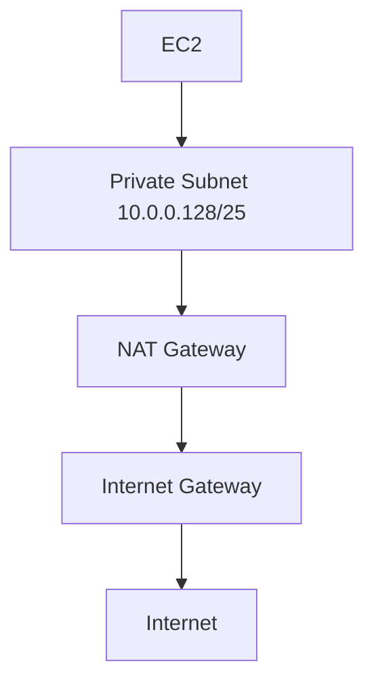

# Project Name: DevOps Boootcamp Project

# Objektif
- Membina AWS infrastruktur menggunakan kemahiran DevOps
- Mempraktikkan dua belas keluarga dalam satu sistem

# Senarai 12 Keluarga
1. DevOps
2. Linux
3. Git
4. GitHub
5. AWS
6. Cloudflare
7. Docker
8. CI/CD
9. Terraform
10. Ansible
11. Prometheus
12. Grafana

---

# Pemeriksaan Kesediaan Persekitaran Kerja

## Host
wsl --version\
WSL version: 2.6.1.0\
Kernel version: 6.6.87.2-1\
WSLg version: 1.0.66\
MSRDC version: 1.2.6353\
Direct3D version: 1.611.1-81528511\
DXCore version: 10.0.26100.1-240331-1435.ge-release\
Windows version: 10.0.26200.9445

docker --version\
Docker version 29.6.1, build 8900f1d

docker compose version\
Docker Compose version v5.3.0

## WSL
aws --version\
aws-cli/2.34.64 Python/3.14.5 Linux/6.6.87.2-microsoft-standard-WSL2 exe/x86_64.ubuntu.24\

git --version\
git version 2.43.0

terraform --version\
Terraform v1.15.8 on linux_amd64

Your version of Terraform is out of date! The latest version is 1.16.2.

Remark:
- After upgrade Terraform version

\
terraform --version\
Terraform v1.16.2 on linux_amd64

ansible --version\
ansible [core 2.21.2]\
  config file = /etc/ansible/ansible.cfg
  configured module search path = ['/home/hadi/.ansible/plugins/modules', '/usr/share/ansible/plugins/modules']
  ansible python module location = /usr/lib/python3/dist-packages/ansible
  ansible collection location = /home/hadi/.ansible/collections:/usr/share/ansible/collections
  executable location = /usr/bin/ansible
  python version = 3.12.3 (main, Aug 31 2026, 10:18:26) [GCC 13.3.0] (/usr/bin/python3)
  jinja version = 3.1.2
  pyyaml version = 6.0.1 (with libyaml v0.2.5)

## Pengujian komunikasi Docker Desktop dengan WSL
docker run --rm hello-world\
Unable to find image 'hello-world:latest' locally\
latest: Pulling from library/hello-world\
4f55086f7dd0: Pull \
d5e71e642bf5: Download complete\
Digest: sha256:5e23090353324d887c48ad5e5c56d294eab81588df9605b07d1afe895f9cc8f8\
Status: Downloaded newer image for hello-world:latest

## Periksa AWS Sumber

### Pengguna IAM
aws iam get-user\
{
    "User": {
        "Path": "/",
        "UserName": "iam-xxxx",
        "UserId": "AIDA2MF5YZJFIAJxxxxxx",
        "Arn": "arn:aws:iam::713362xxxxxx:user/iam-hadi",
        "CreateDate": "2026-09-13T03:32:30+00:00"
    }
}

Remark:
- Boleh balik rujuk nota XXX

### Kumpulan Pengguna
aws iam list-groups-for-user \
  --user-name iam-xxx

{
    "Groups": []
}

### Semak Polisi
aws iam list-attached-user-policies \
  --user-name iam-xxxx

{
    "AttachedPolicies": [
        {
            "PolicyName": "AdministratorAccess",
            "PolicyArn": "arn:aws:iam::aws:policy/AdministratorAccess"
        }
    ]
}

### Konfigurasi Akses
aws sts get-caller-identity
{
    "UserId": "AIDA2MF5YZJFIAJ7xxxxx",
    "Account": "713362xxxxx",
    "Arn": "arn:aws:iam::713362xxxxxx:user/iam-xxxx"
}

### Lokasi
aws configure get region
ap-southeast-1

### VPC
aws ec2 describe-vpcs \
  --region ap-southeast-1 \
  --query 'Vpcs[*].[VpcId,CidrBlock,Tags]' \
  --output table

Remark:
- Tiada VPC konfigurasi

### Subnets
aws ec2 describe-subnets \
  --region ap-southeast-1 \
  --query 'Subnets[*].[SubnetId,VpcId,CidrBlock,AvailabilityZone,MapPublicIpOnLaunch]' \
  --output table

Remark:
- Tiada Subnet konfigurasi

### Instances
aws ec2 describe-instances \
  --region ap-southeast-1 \
  --query 'Reservations[*].Instances[*].[InstanceId,PrivateIpAddress,PublicIpAddress,State.Name,Tags]' \
  --output table

Remark:
- Tiada Instance konfigurasi

# Checklist
Date: 2026-09-13
Time: 1230

- [x] Host readiness
- [x] AWS konfigurasi

---

# Cipta Folder Kerja
mkdir ~/devops-bootcamp-terraform-mhadiyahya
mkdir ~/devops-bootcamp/final-project-mhadiyahya
mkdir ~/devops-bootcamp-project

Remark:
- Folder kerja ini akan digunakan sebagai Repo di GitHub

#  Menyediakan Terraform fail

## File TF provider.tf
Di fail ini dinyatakan provider and region AWS
- Provider: AWS
- Reqion: ap-southeast-1

Remark: ap-southeast-1 berada di Singapore

## File TF network.tf
Di fail ini dinyatakan network di AWS
| Jenis Rangkaian | Name | Detail | Remark |
| :-- | :-- | :-- | :-- | 
| VPC | devops-vpc | 10.0.0.0/24 | Mempunyai 256 IP Address | 
| subnet public | devops-public-subnet | 10.0.0.0/25 | Pecahan pertama IP Address 10.0.0.0 - 10.0.0.127 |
| subnet private | devops-private-subnet | 10.0.0.128/25 | Pecahan pertama IP Address 10.0.0.128 - 10.0.0.255 |
| route table public | devops-public-route | | |
| route table private | devops-private-route | | |
| gateway | devops-igw | | |
| gateway | devops-ngw | | |

## Terraform Format
terraform fmt

Remark:
- Bagi mengemaskan code

## Initialize Terraform
terraform init

terraform init
Initializing the backend...

Initializing provider plugins...
- Finding hashicorp/aws versions matching "~> 6.0"...
- Installing hashicorp/aws v6.64.0...
- Installed hashicorp/aws v6.64.0 (signed by HashiCorp)

Terraform has created a lock file .terraform.lock.hcl to record the provider
selections it made above. Include this file in your version control repository
so that Terraform can guarantee to make the same selections by default when
you run "terraform init" in the future.

Terraform has been successfully initialized!

You may now begin working with Terraform. Try running "terraform plan" to see
any changes that are required for your infrastructure. All Terraform commands
should now work.

If you ever set or change modules or backend configuration for Terraform,
rerun this command to reinitialize your working directory. If you forget, other
commands will detect it and remind you to do so if necessary.

Remark:
- Initialize berjaya

## Validate
terraform validate

Success! The configuration is valid.

## Terraform Plan
terraform plan

Plan: 3 to add, 0 to change, 0 to destroy.

Remark:
- 3 plan untuk di tambah adalah merujuk kepada VPC, Public Subnet, dan Private Subnet.
- Diperingkat ini review plan sebelum apply.

## Terraform Apply
terraform apply

Plan: 3 to add, 0 to change, 0 to destroy.

Do you want to perform these actions?
  Terraform will perform the actions described above.
  Only 'yes' will be accepted to approve.

  Enter a value: <yes|no>

aws_vpc.devops_vpc: Creating...
aws_vpc.devops_vpc: Creation complete after 4s [id=vpc-03e3081ff4b1d161e]
aws_subnet.private_subnet: Creating...
aws_subnet.public_subnet: Creating...
aws_subnet.private_subnet: Creation complete after 0s [id=subnet-00f409c0be083e3e8]
aws_subnet.public_subnet: Still creating... [00m10s elapsed]
aws_subnet.public_subnet: Creation complete after 11s [id=subnet-0b9a674ba29be81a2]

Apply complete! Resources: 3 added, 0 changed, 0 destroyed.

Remark:
- Boleh menggunakan command ini sebagai alternative terraform apply -auto-approve
- Terraform apply berjaya.

## Periksa AWS Setelah Terraform Berjaya
aws ec2 describe-vpcs \
  --filters "Name=tag:Name,Values=devops-vpc" \
  --query 'Vpcs[*].[VpcId,CidrBlock]' \
  --output table

Remark:
- Output menunjukkan VPC tercipta dengan subnet 10.0.0.0/24

aws ec2 describe-subnets \
  --filters "Name=tag:Project,Values=mhadiyahya" \
  --query 'Subnets[*].[SubnetId,CidrBlock,AvailabilityZone,MapPublicIpOnLaunch]' \
  --output table

Remark:
- Terdapat dua subnet dicipta.
- Subnet pertama untuk public dengan subnet 10.0.0.0/25
- Subnet kedua untuk private dengan subnet 10.0.0.128/25
- Network sudah tersedia.
- Seterusnya buat Internet Gateway, Route Table, and NAT Gateway.

### Network Diagram Public Subnet

### Network Diagram Private Subnet

# Checklist
Date: 2026-09-13
Time: 1304

- [x] AWS Provide
- [x] VPC
- [x] Public subnet
- [x] Private subnet

---

# Mencipta Internet Gateway

## Periksa terraform state
terraform state list
aws_subnet.private_subnet
aws_subnet.public_subnet
aws_vpc.devops_vpc

## Update network.tf file

### Tambah resource bagi IGW

resource "aws_internet_gateway" "devops_igw" {
  vpc_id = aws_vpc.devops_vpc.id

  tags = {
    Name    = "devops-igw"
    Project = "mhadiyahya"
  }
}

Remark:
- Cipta IGW.

### Tambah Public Route Table

resource "aws_route_table" "public_route" {
  vpc_id = aws_vpc.devops_vpc.id

  route {
    cidr_block = "0.0.0.0/0"
    gateway_id = aws_internet_gateway.devops_igw.id
  }

  tags = {
    Name    = "devops-public-route"
    Project = "mhadiyahya"
  }
}

Remark:
- Semua network traffic 0.0.0.0/0 akan route ke IGW.

### Sambung Public Subnet Kepada Route Table

resource "aws_route_table_association" "public_route_association" {
  subnet_id      = aws_subnet.public_subnet.id
  route_table_id = aws_route_table.public_route.id
}

Remark:
- Flow devops-public-subnet > devop-public-route > devop-igw
- Route table untuk public lengkap

## Update workflow Terraform
terraform fmt\
terraform validate\
terraform plan

Remark:
- Plan: 3 to add, 0 to change, 0 to destroy.
- 3 plan itu adalah IGW, Route Table, Route Table Association bagi Public Subnet.

terraform apply

Remark:
- Apply complete! Resources: 3 added, 0 changed, 0 destroyed.

## Network Diagram bagi Public Subnet

# Checklist
Date: 2026-09-13
Time: 1324

- [x] IGW
- [x] Public Route Table
- [x] Public Route Association

---

# Cipta Private Subnet Ke Internet, Menetapkan Elastic IP dan NAT Gateway

## Periksa terraform state
terraform state list
aws_internet_gateway.devops_igw
aws_route_table.public_route
aws_route_table_association.public_route_association
aws_subnet.private_subnet
aws_subnet.public_subnet
aws_vpc.devops_vpc

## Update network.tf file

### Tetapan Elastic IP

resource "aws_eip" "nat_eip" {
  domain = "vpc"

  tags = {
    Name    = "devops-nat-eip"
    Project = "mhadiyahya"
  }
}

Remark:
- Elastic IP ini akan digunakan oleh NAT Gateway.

### Cipta NAT Gateway

resource "aws_nat_gateway" "devops_ngw" {
  allocation_id = aws_eip.nat_eip.id
  subnet_id     = aws_subnet.public_subnet.id

  depends_on = [
    aws_internet_gateway.devops_igw
  ]

  tags = {
    Name    = "devops-ngw"
    Project = "mhadiyahya"
  }
}

Remark:
- NAT Gateway mesti berada dalam public subnet, bukan private subnet.

### Private Route Table

resource "aws_route_table" "private_route" {
  vpc_id = aws_vpc.devops_vpc.id

  route {
    cidr_block     = "0.0.0.0/0"
    nat_gateway_id = aws_nat_gateway.devops_ngw.id
  }

  tags = {
    Name    = "devops-private-route"
    Project = "mhadiyahya"
  }
}

Remark:
- Private traffic ke Internet
- 10.0.0.0/128 > devops-private-route > 0.0.0.0/0 > devops-ngw

### Sambung Private Subnet ke Route Table

resource "aws_route_table_association" "private_route_association" {
  subnet_id      = aws_subnet.private_subnet.id
  route_table_id = aws_route_table.private_route.id
}

Remark:
- Flow devops-private-subnet > devops-private-route

## Update workflow Terraform
terraform fmt\
terraform validate\
terraform plan

Remark:
- Plan: 4 to add, 0 to change, 0 to destroy.
- 1 plan itu adalah Elastic IP.
- 3 plan lagi untuk NAT Gateway, Route Table, Route Table Associate untuk Private Subnet. 

terraform apply

Remark:
- Apply complete! Resources: 3 added, 0 changed, 0 destroyed.

## Network Diagram bagi Private Subnet

## Verify AWS Networking

NAT Gateway\
aws ec2 describe-nat-gateways \
  --filter "Name=tag:Name,Values=devops-ngw" \
  --query 'NatGateways[*].[NatGatewayId,State,SubnetId]' \
  --output table

Remark:
- NAT Gateway status available

\
Elastic IP\
aws ec2 describe-addresses \
  --region ap-southeast-1 \
  --output json

aws ec2 describe-addresses \
  --region ap-southeast-1 \
  --query "Addresses[*].[AllocationId,PublicIp,Tags[?Key=='Name']|[0].Value]" \
  --output table

Remark:
- Public IP given

Route Tables\
aws ec2 describe-route-tables \
  --filters "Name=vpc-id,Values=$(aws ec2 describe-vpcs \
  --filters 'Name=tag:Name,Values=devops-vpc' \
  --query 'Vpcs[0].VpcId' \
  --output text)" \
  --query 'RouteTables[*].[RouteTableId,Routes,Tags]' \
  --output json

Remark:
- 10.0.0.0/24 - devops-private-route
- 0.0.0.0/0 - IGW

\
> [!CAUTION]\
> Network setting dibawah tidak percuma di AWS. Sila buang/destroy selesai selesai testing.
> 1. NAT Gateway
> 2. Elastic IP
> 3. EC2
> 4. EBS

## Destory
terraform plan -destroy\
terraform destroy

# Checklist
Date: 2026-09-13
Time: 1324

- [x] Elastic IP (Public IP Address verify at AWS Portal)
- [x] NAT Gateway
- [x] Private Route Table
- [x] Private Route Association

---

# AWS Security
Berdasarkan artiktektur project, hanya port 80 sahaja yang perlu dibuka untuk access kepada Web Server.\
Pastikan semua instance mempunya internet connection.\
Instance hanya boleh diakses melalui SSM.

> [!WARNING]\
> SSH port 22 is prohobited.

## File TF security.tf
Dibahagikan kepada dua bahagian:\
- Public Security
- Private Security

### Public Security
- Allow incoming port 80 for web server.
- Allow incoming port 9100 to 10.0.0.136/32 (monitoring)
- Allow egress connection to Internet.

### Private Security
- Allow egress connection to Internet.

# AWS IAM Role untuk SSM
Cipta IAM role baru untuk kegunaan EC2 instance.\
Kenapa tidak iam-hadi, kerana user ini mempunyai access penuh.

## File TF iam.tf
Cipta IAM role baru bernama devops-ssm-role.\
Assign policy AmazonSSMManagedInstanceCore.

# AWS EC2

## File TF compute.tf
Tetapkan root image.\
Cipta config EC2 bagi Web Server, Controller, dan Monitoring.\
Tetapan Private IP Address kepada ketiga-tiga EC2.\
Tetapan Elastic IP Address kepada Web Server.\
Tetapan tiada public IP Address kepada Controller dan Monitoring.

## Update workflow Terraform
terraform fmt\
terraform validate\
terraform plan

Remark:
- Plan: 14 to add, 0 to change, 0 to destroy.
- Senarai Plan:
1. Compute: AMI image Ubuntu 24.04 LTS
2. Compute: 1x EC2 Controller
3. Compute: 1x EC2 Monitoring
4. Compute: 1x EC2 Web Server
5. Network: Tetap Web Server kepada Elastic IP
6. Network: Resource allocation for Web Server 
7. IAM: Cipte new IAM Role devops-ssm-role
8. IAM: Assign policy
9. IAM: Cipta profile devops-ssm-instance-profile
10. Security: Security Public Group and Security Private Group
11. Security: Rule allow incoming port 80 from Internet
12. Security: Rule allow monitoring server to access Node Exporter
13. Security: Rule allow Egress public traffic
14. Security: Rule allow Egress private traffic

terraform apply

Remark:
- Apply complete! Resources: 14 added, 0 changed, 0 destroyed.

# Verify EC2 deployed
aws ec2 describe-instances \
  --region ap-southeast-1 \
  --filters "Name=tag:Project,Values=mhadiyahya" \
  --query 'Reservations[].Instances[].[Tags[?Key==`Name`]|[0].Value,InstanceId,PrivateIpAddress,PublicIpAddress,State.Name]' \
  --output table

Remark:
| Instance | Private IP | Public IP | Status |
| :-- | :-- | :-- | :-- |
| devops-web-server | 10.0.0.5 | 18.136.237.99 | running |
| devops-monitoring | 10.0.0.136 | none | running |
| devops-controller | 10.0.0.135 | none | running |

# Verify SSM on EC2
aws ssm describe-instance-information \
  --region ap-southeast-1 \
  --query 'InstanceInformationList[*].[InstanceId,PingStatus,PlatformName,AgentVersion]' \
  --output table

# Instance Access using SSM
Web-Server

Controller

Monitoring

# Instance Ping Internet
Web-Server

Controller

Monitoring

# Checklist
Date: 2026-09-13
Time: 1540

- [x] IAM Role for devops-ssm-role
- [x] Compute konfigurasi
- [x] Private network ketiga-tiga EC2
- [x] Berjaya set public IP web-server menggunakan Elastic IP
- [x] Berjaya access ketiga-tiga EC2 menggunkan Console x SSM.
- [x] Ping google, ping yahoo, dan ping cloudflare berjaya dari EC2.
- [x] Ping diantara ketiga-tiga EC2 tidak dibenarkan. Protcol ICMP tidak dimasukkan kepada security group.

# Optional

## Add local ping
resource "aws_vpc_security_group_ingress_rule" "public_icmp" {
  security_group_id = aws_security_group.public_sg.id

  cidr_ipv4   = "10.0.0.0/24"
  ip_protocol = "icmp"
  from_port   = -1
  to_port     = -1

  description = "Allow ICMP from VPC"
}

resource "aws_vpc_security_group_ingress_rule" "private_icmp" {
  security_group_id = aws_security_group.private_sg.id

  cidr_ipv4   = "10.0.0.0/24"
  ip_protocol = "icmp"
  from_port   = -1
  to_port     = -1

  description = "Allow ICMP from VPC"
}
---

# Backend Terraform
Buat masa ini terraform files berada di local.
Untuk langkah berikutnya saya akan migrate ke S3 Bucket.
Selepas itu tukar kepada block backend.

## Migration Prep

### Verify state
terraform state list
data.aws_ami.ubuntu
aws_eip.nat_eip
aws_eip.web_eip
aws_eip_association.web_eip_association
aws_iam_instance_profile.ssm_profile
aws_iam_role.ssm_role
aws_iam_role_policy_attachment.ssm_core
aws_instance.controller
aws_instance.monitoring
aws_instance.web_server
aws_internet_gateway.devops_igw
aws_nat_gateway.devops_ngw
aws_route_table.private_route
aws_route_table.public_route
aws_route_table_association.private_route_association
aws_route_table_association.public_route_association
aws_security_group.private_sg
aws_security_group.public_sg
aws_subnet.private_subnet
aws_subnet.public_subnet
aws_vpc.devops_vpc
aws_vpc_security_group_egress_rule.private_egress
aws_vpc_security_group_egress_rule.public_egress
aws_vpc_security_group_ingress_rule.public_http
aws_vpc_security_group_ingress_rule.public_node_exporter

### Check any pending plan
terraform plan

Remark:
- Plan: 2 to add, 0 to change, 2 to destroy.
- Action: # aws_eip_association.web_eip_association must be replaced
- Action: # aws_instance.web_server must be replaced

### Validate
Plan: 2 to add, 0 to change, 2 to destroy. - sbb nak tukar associate_public_ip_address = false\
go to go with terraform apply.

## Migration ke S3 

### Create bucket
aws s3api create-bucket \
  --bucket devops-bootcamp-terraform-mhadiyahya \
  --region ap-southeast-1 \
  --create-bucket-configuration LocationConstraint=ap-southeast-1

Remark:
{
    "Location": "http://devops-bootcamp-terraform-mhadiyahya.s3.amazonaws.com/",
    "BucketArn": "arn:aws:s3:::devops-bootcamp-terraform-mhadiyahya"
}

### Versioning
aws s3api put-bucket-versioning \
  --bucket devops-bootcamp-terraform-mhadiyahya \
  --versioning-configuration Status=Enabled

### Block public access
aws s3api put-public-access-block \
  --bucket devops-bootcamp-terraform-mhadiyahya \
  --public-access-block-configuration \
  BlockPublicAcls=true,IgnorePublicAcls=true,BlockPublicPolicy=true,RestrictPublicBuckets=true

### Encryption
aws s3api put-bucket-encryption \
  --bucket devops-bootcamp-terraform-mhadiyahya \
  --server-side-encryption-configuration \
  '{"Rules":[{"ApplyServerSideEncryptionByDefault":{"SSEAlgorithm":"AES256"},"BucketKeyEnabled":true}]}'

### Verification
Verify Status\
aws s3api get-bucket-versioning \
  --bucket devops-bootcamp-terraform-mhadiyahya

Remark:
{
    "Status": "Enabled"
}

Verify Block\
aws s3api get-public-access-block \
  --bucket devops-bootcamp-terraform-mhadiyahya

Remark:
{
    "PublicAccessBlockConfiguration": {
        "BlockPublicAcls": true,
        "IgnorePublicAcls": true,
        "BlockPublicPolicy": true,
        "RestrictPublicBuckets": true
    }
}

Verify Encryption\
aws s3api get-bucket-encryption \
  --bucket devops-bootcamp-terraform-mhadiyahya

Remark:
{
    "ServerSideEncryptionConfiguration": {
        "Rules": [
            {
                "ApplyServerSideEncryptionByDefault": {
                    "SSEAlgorithm": "AES256"
                },
                "BucketKeyEnabled": true,
                "BlockedEncryptionTypes": {
                    "EncryptionType": [
                        "SSE-C"
                    ]
                }
            }
        ]
    }
}

Verity Content\
aws s3api list-objects-v2 \
  --bucket devops-bootcamp-terraform-mhadiyahya

Remark:
{
    "RequestCharged": null,
    "Prefix": ""
}

### Buat data sandaran
cp terraform.tfstate terraform.tfstate.pre-s3-migration.backup\
ls -lh terraform.tfstate*\
Permissions Size User Date Modified Name\
.rw-r--r--   56k hadi 13 Sep 16:40  󱁢 terraform.tfstate\
.rw-r--r--   54k hadi 13 Sep 16:40   terraform.tfstate.backup\
.rw-r--r--   56k hadi 13 Sep 16:55   terraform.tfstate.pre-s3-migration.backup

### Migrate init
terraform fmt\
terraform init -migrate-state

Remark:
- Successfully configured the backend "s3"! Terraform will automatically use this backend unless the backend configuration changes.
- Terraform has been successfully initialized!

### Migrate post
terraform state list
terraform plan

Remark:
- No changes. Your infrastructure matches the configuration.

### Verify remote state
aws s3api list-objects-v2 \
  --bucket devops-bootcamp-terraform-mhadiyahya \
  --prefix devops-bootcamp-project/ \
  --query 'Contents[].{Key:Key,Size:Size,LastModified:LastModified}' \
  --output table

Remark:
| Key | astModified | Size |
| :-- | :-- | :-- |
| devops-bootcamp-project/terraform.tfstate | 2026-09-13T09:05:55+00:00 | 56066 |

## Block Backend

